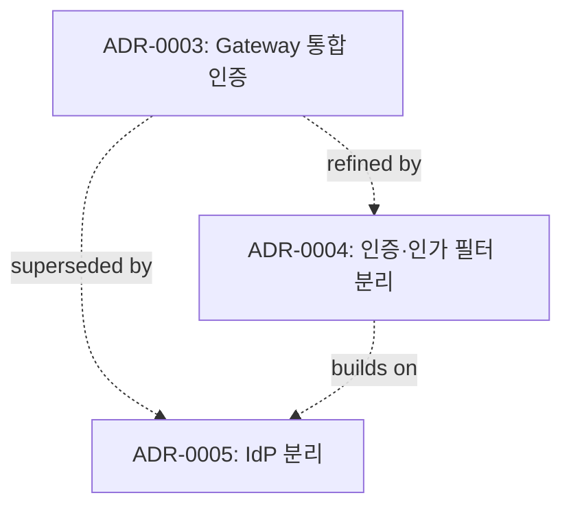

# Architecture Decisions

> 백엔드 시스템을 설계·운영하면서 내린 의사결정의 기록입니다.
> 결정의 결과뿐 아니라 **검토했던 대안과 선택하지 않은 이유**까지 남겨,
> 같은 문제를 만난 다른 분들과 미래의 저에게 도움이 되길 바랍니다.

## 왜 이 저장소를 만들었나

- 시간이 지나면 **"왜 그렇게 결정했는지"** 가 가장 먼저 잊힙니다.
- 코드는 결과만 보여주지만, ADR은 **그 결과에 도달한 사고 과정**을 남깁니다.
- "지금이라면 다르게 결정했을까?"를 정직하게 회고하기 위한 도구입니다.

## 인덱스

| ID | 제목 | Status | Date | Tags |
|---|---|---|---|---|

## 결정 궤적 (시각화)

> 어떤 결정이 어떤 결정으로 이어졌는지

## 사용한 템플릿
[template.md](./template.md) — MADR-lite 기반

## 표기 규칙
- **Status**: `Proposed` / `Accepted` / `Superseded by ADR-NNNN` / `Deprecated`
- **수정 이력**: 결정이 바뀌면 옛 ADR을 지우지 않고 `Status`만 변경, 새 ADR을 추가합니다.
- 모든 사례는 **회사 식별 정보를 제외한 추상화된 형태**로 정리합니다.
