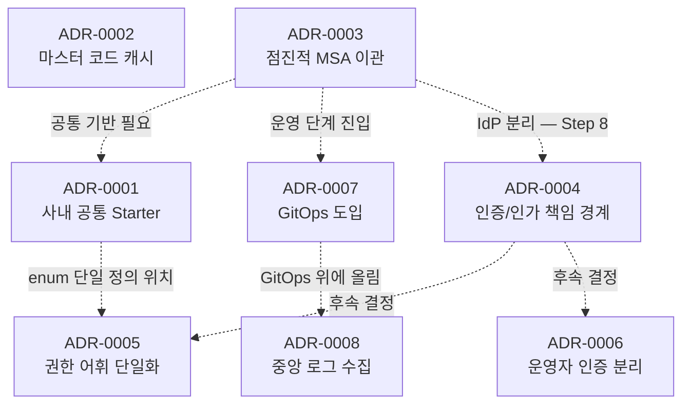

# Architecture Decisions

> 백엔드 시스템을 설계·운영하면서 내린 의사결정의 기록입니다.
> 결정의 결과뿐 아니라 **검토했던 대안과 선택하지 않은 이유**까지 남겨,
> 같은 문제를 만난 다른 분들과 미래의 저에게 도움이 되길 바랍니다.

## 왜 이 저장소를 만들었나

- 시간이 지나면 **"왜 그렇게 결정했는지"** 가 가장 먼저 잊힙니다.
- 코드는 결과만 보여주지만, ADR은 **그 결과에 도달한 사고 과정**을 남깁니다.
- "지금이라면 다르게 결정했을까?"를 정직하게 회고하기 위한 도구입니다.

## 인덱스

| ID | 제목 | Status | Date |
|---|---|---|---|
| [0001](./adr/0001-사내-공통-스타터-라이브러리-도입.md) | 사내 공통 기능을 Spring Boot Starter 형태의 멀티 모듈 라이브러리로 제공 | Accepted | 2025-06-02 |
| [0002](./adr/0002-마스터-코드-캐시-워밍업을-별도-빈으로-분리.md) | 마스터 코드 조회를 메모리 캐시 + 기동 시 워밍업으로 전환 | Accepted | 2026-05-04 |
| [0003](./adr/0003-점진적-MSA-이관.md) | DB는 그대로 두고 API만 재설계하는 점진적 MSA 이관 | Accepted (진행 중) | 2025-07-07 |
| [0004](./adr/0004-인증-인가-책임-경계-재정의.md) | 인증/인가 책임 경계 재정의 — Gateway는 인증, Service는 인가 | Proposed | 2026-05-19 |
| [0005](./adr/0005-권한-어휘의-단일-진실.md) | 권한 어휘의 단일 진실 — 구독 단위 권한 모델 | Proposed | 2026-05-19 |
| [0006](./adr/0006-운영자-인증-경계의-의도적-분리.md) | 운영자 인증 경계의 의도적 분리 — LDAP-only, IdP와 분리 | Proposed | 2026-05-19 |
| [0007](./adr/0007-GitOps-도입.md) | GitOps 도입 — Jenkins(Build) + ArgoCD(Deploy) | Accepted | 2026-05-20 |
| [0008](./adr/0008-중앙-로그-수집.md) | 중앙 로그 수집 — Filebeat DaemonSet → Elasticsearch 직결 | Accepted (dev) | 2026-05-22 |

## 영역별 보기

- **플랫폼 / 표준화**: [0001](./adr/0001-사내-공통-스타터-라이브러리-도입.md)
- **성능 / 캐시**: [0002](./adr/0002-마스터-코드-캐시-워밍업을-별도-빈으로-분리.md)
- **MSA 이관 / 레거시**: [0003](./adr/0003-점진적-MSA-이관.md)
- **인증 / 인가**: [0004](./adr/0004-인증-인가-책임-경계-재정의.md) · [0005](./adr/0005-권한-어휘의-단일-진실.md) · [0006](./adr/0006-운영자-인증-경계의-의도적-분리.md)
- **CI/CD / 인프라**: [0007](./adr/0007-GitOps-도입.md) · [0008](./adr/0008-중앙-로그-수집.md)

## 결정 궤적

> 어떤 결정이 어떤 결정으로 이어졌는지

## 사용한 템플릿

[template.md](./template.md) — MADR-lite 기반.

각 ADR은 `Context → Decision → Alternatives Considered → Consequences → Lessons Learned → TODO → References` 순서로 작성하며, 결정의 누적 흐름을 추적하기 위한 `Journey` 섹션을 일부 ADR에 둡니다.

## 표기 규칙

- **Status**: `Proposed` / `Accepted` / `Superseded by ADR-NNNN` / `Deprecated`
- **수정 이력**: 결정이 바뀌면 옛 ADR을 지우지 않고 `Status`만 변경, 새 ADR을 추가합니다.
- **추상화 수준**: 모든 사례는 회사 식별 정보(특정 제품명, 정확한 규모 수치, 사내 클래스/헤더 이름 등)를 가능한 범위에서 추상화해서 정리합니다. 의사결정의 본질(맥락·대안·결과·교훈)을 유지하는 데 필요한 만큼만 구체적인 표현을 남깁니다.

## 관련

- [resume.yeinkim.dev](https://resume.yeinkim.dev) — 본 저장소의 ADR이 이력서/경력기술서에서 인용되는 위치
